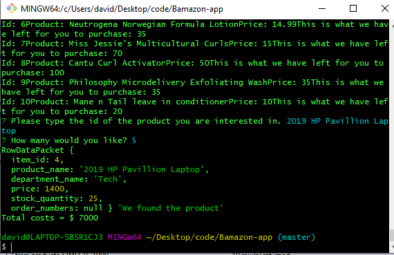

# Bamazon-app

Hi this is my Bamazon app. It's supposed to be like Amazon, except it isn't. Customers are presented with a list of items to choose from, they enter the item they want and how many units and the mySQL database will give them the items according to how many are in stock. The user is then either given the total price of the transaction or they are told that the item is no longer in stock.

In order to use Bamazon:

1. Have a mySQL database set up on your computer. Then include the following:
const connection = mysql.createConnection({
    host: "localhost",
    port: 3306,
    user: "root",
    password: "",
    database: "bamazon"
});
    You will have to create your own password.

2. Git clone my repo: https://github.com/davidmstanleyjr/Bamazon-app.git
3. From git bash do npm install 
Inquirer: https://www.npmjs.com/package/inquirer
MySQL: https://www.npmjs.com/package/mysql

4. From git bash run node bamazonCustomer.js. There will be a list of items to choose from. Type in your item and you can either purchase it or you will be told that it's no longer in stock.

I hope you enjoy it. I had a great time creating it.

